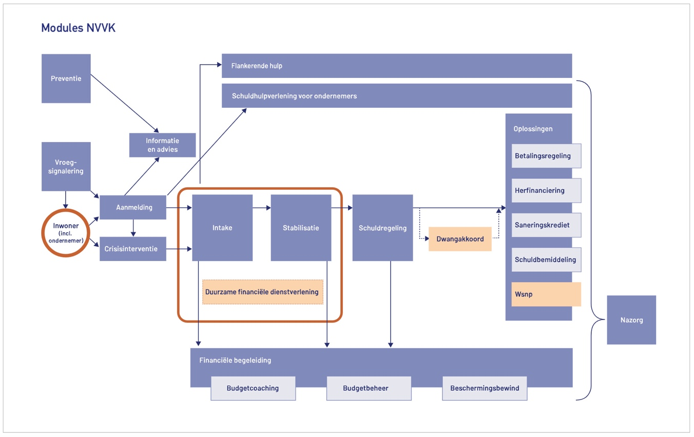

# Inleiding Schuldhulpverlening

Het programma **Doorontwikkeling Digitaal Aanleveren Schuldhulpverleningsgegevens (DDAS)** ondersteunt gemeenten en uitvoeringsorganisaties bij het gestructureerd aanleveren van gegevens over schuldhulpverlening aan het Centraal Bureau voor de Statistiek (CBS). Het doel van DDAS is om de informatievoorziening over schuldhulpverlening te verbeteren, zodat beleidsmakers, onderzoekers en uitvoerders beter inzicht krijgen in de werking en effectiviteit van schuldhulptrajecten in Nederland.

## Gegevensverzameling voor het CBS

Binnen DDAS worden gegevens worden op het gebied van schuldhulpverlening gegevens verzameld. In deze website vindt u de technische specificaties voor deze aanlevering en de bijbehorende uitleg. 

Deze gegevens worden door schuldhulpverleners of gemeentelijke diensten vastgelegd in hun eigen registratiesystemen. DDAS biedt een standaard gegevensmodel en aanleverspecificaties, waarmee deze gegevens digitaal en op uniforme wijze aan het CBS kunnen worden aangeboden.

Door deze gestandaardiseerde aanlevering wordt het mogelijk om landelijk vergelijkbare en betrouwbare statistieken te maken, zonder dat individuele hulpvragers herleidbaar zijn. Dit draagt bij aan beleidsvorming, monitoring en verbetering van schuldhulpverlening op lokaal en landelijk niveau.

## Informatie- en uitwisselmodel

Een informatiemodel is een gestructureerde representatie van gegevens en hun onderlinge relaties binnen een bepaald domein. Het helpt bij het standaardiseren van gegevens door uniforme definities, formats en regels vast te leggen voor hoe informatie wordt opgeslagen, uitgewisseld en geïnterpreteerd. Dit bevordert consistentie, duidelijkheid en interoperabiliteit tussen verschillende systemen en afdelingen, waardoor efficiëntie en datakwaliteit verbeteren.

Om te komen tot goed gestandaardiseerde definities over schuldhulpverlening is een informatiemodel Schuldhulpverlening opgesteld, deze is in dit document nader uitgewerkt.

Een uitwisselmodel is een gestructureerde set van afspraken en standaarden voor de manier waarop gegevens tussen organisaties wordt uitgewisseld. Dit model is afgeleid van een informatiemodel, dat de basis vormt door de gegevensstructuren en -relaties binnen een domein te definiëren. Het uitwisselmodel specificeert welke gegevenselementen uit het informatiemodel relevant zijn voor uitwisseling en in welk formaat deze moeten worden aangeleverd. Hierdoor wordt de consistentie en compatibiliteit van gegevensoverdracht tussen organisaties gewaarborgd, wat de efficiëntie en betrouwbaarheid van de data-aanlevering verbetert. In het uitwisselmodel hoeven niet alle gegevens uit het informatiemodel worden meegenomen.

In dit document worden zowel het informatiemodel als het uitwisselmodel beschreven. Op basis van het informatiemodel Schuldhulpverlening is in dit document het uitwisselmodel Schuldhulpverlening opgenomen, dat de basis vormt voor het beschikbaar stellen van schuldhulpgegevens.

## NVVK-Referentieproces

Als uitgangspunt voor het informatiemodel schuldhulpverlening is het proces dat door de NVVK is beschreven genomen. Schuldhulpverleners binnen Nederland werken conform dit proces.

Figuur 1 NVVK Proceschema

Het NVVK-proces voor schuldhulpverlening, gehanteerd door de NVVK, omvat een gestructureerde aanpak om mensen met problematische schulden te helpen. Dit proces begint met een intakefase, waarin de schuldhulpverlener samen met de schuldenaar een overzicht maakt van de leefstituatie, inclusief alle schulden, inkomsten en uitgaven. Vervolgens wordt een plan van aanpak opgesteld, waarin mogelijke oplossingen worden verkend, zoals betalingsregelingen, herstructurering van schulden of, indien noodzakelijk, wettelijke schuldsanering. In deze fase wordt ook gekeken naar de oorzaken van de schulden en worden maatregelen getroffen om herhaling te voorkomen, zoals budgetcoaching of het versterken van financiële vaardigheden.

Na de intake en planvorming volgt de uitvoeringsfase, waarin de schuldhulpverlener de afgesproken maatregelen implementeert. Dit kan onder meer inhouden het onderhandelen met schuldeisers om tot haalbare betalingsregelingen te komen, het aanvragen van schuldhulpverleningstrajecten of het begeleiden van de schuldenaar door een wettelijke schuldsaneringsregeling. Gedurende deze fase blijft de schuldhulpverlener de voortgang monitoren en ondersteunt hij de schuldenaar bij het naleven van het plan. Het proces wordt afgesloten met een nazorgfase, waarin de schuldenaar geholpen wordt om financieel stabiel te blijven en terugval te voorkomen. Het NVVK-proces is gericht op duurzame oplossingen, waarbij zowel de schuldenaar als de schuldeisers worden betrokken om tot een succesvolle afronding van het schuldhulptraject te komen.

## Routekaart Financiële Zorgen

Nu werken de meeste schuldhulpverleningspartijen conform het NVVK-model. Dit model is als basis genomen voor de uitvraag van de data, zoals het nu is. Zo kunnen de meest accurate gegevens worden verzameld.

Daarnaast is van belang om de [basisdienstverlening](https://www.rijksoverheid.nl/actueel/nieuws/2024/03/21/basisdienstverlening-schuldhulpverlening-in-iedere-gemeente) mee te nemen. Tussen het ministerie van SZW, VNG, NVVK en Divosa zijn bestuurlijk afspraken gemaakt over 20 elementen basisdienstverlening die de komende periode ingezet gaan worden, ook enkele elementen die aanvullend zijn op de NVVK-model. Een deel van de data die betrekking heeft op de basisdienstverlening is al meegenomen in de vastgestelde uitvraag. Aanvullend daarop zal de uitvraag op termijn worden uitgebreid met de data die te maken hebben met deze basisdienstverlening.

Naast het NVVK-model is een andere ontwikkeling van belang, de [Routekaart Financiële Zorgen (RFZ)](https://vng.nl/artikelen/de-routekaart-financiele-zorgen). De achterliggende gegevens bij de RFZ komen voor een deel overeen, waardoor er ook uitspraken gedaan kunnen worden over dienstverlening conform de RFZ. Ook hier is goed om aan te geven dat op termijn de uitvraag uitgebreid wordt met de noodzakelijk gegevens om de aanvullende data met betrekking tot de RFZ op te halen.

